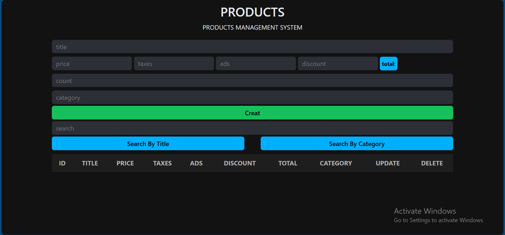
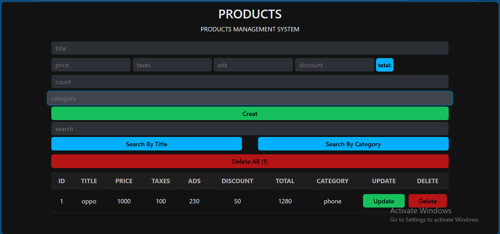
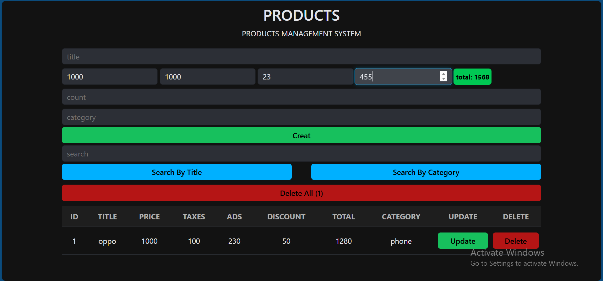

# 📦 Products Management System

A dynamic and responsive **Web Application** built with Vanilla JavaScript to manage product inventories efficiently.
This system allows users to handle product data with ease, featuring a clean and user-friendly interface.

## 🚀 Live Demo
[Click here to view the live project](https://github.com/sarah2-web/products-management-system/) 

## 📸 Screenshots
**Home**

**Add Products**

**Total Price**

> *Tip: You can replace this link with an actual screenshot image after uploading it to your repo.*

## ✨ Features
- **Full CRUD Operations**: Create, Read, Update, and Delete products.
- **Price Calculation**: Automatically calculates total price based on (Price + Taxes + Ads) - Discount.
- **Search Functionality**: Search for products by Title or Category.
- **Data Persistence**: Uses **Local Storage** to save data even after refreshing the page.
- **Validation**: Prevents empty fields and ensures data integrity.
- **Responsive Design**: Works perfectly on desktops and mobile devices.

## 🛠️ Technologies Used
- **HTML5**: Semantic structure.
- **CSS3**: Custom styling and layout.
- **JavaScript (ES6+)**: Core logic and DOM manipulation.
- **Local Storage**: For client-side data saving.

## 📖 How to Use
1. Enter product details (Title, Price, Category, etc.).
2. Click **Create** to save the product.
3. Use the **Search** bar to find specific items.
4. Click **Update** to modify an existing product or **Delete** to remove it.

---
Developed with ❤️ by [Sarah](https://github.com)
